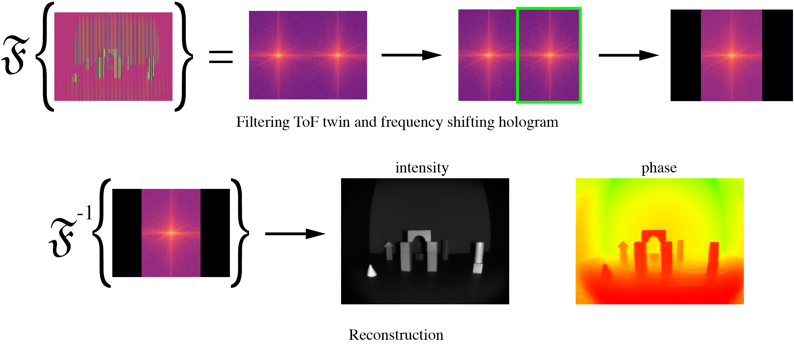

# Snapshot Lidar: Fourier embedding of amplitude and phase for single-image depth reconstruction
​
This repo provides code and notebooks for generating all the figures for the CVPR 2024 paper <em>Snapshot Lidar: Fourier embedding of amplitude and phase for single-image depth reconstruction</em>.
​
## File guide​
- simulation.py: contains a base class for simulations given a ground truth intensity and depth image
- fft_shift.py: contains a child class of simulation for creating a snapshot cwtof simulation
- utils.py: utility functions for simulations
- fig_setup.py: fonts and other setup for paper figures

The Jupyter notebooks in the notebooks subdirectory provide sample code for testing the methods and generating the figures presented in our paper.

## Proposed Technique

